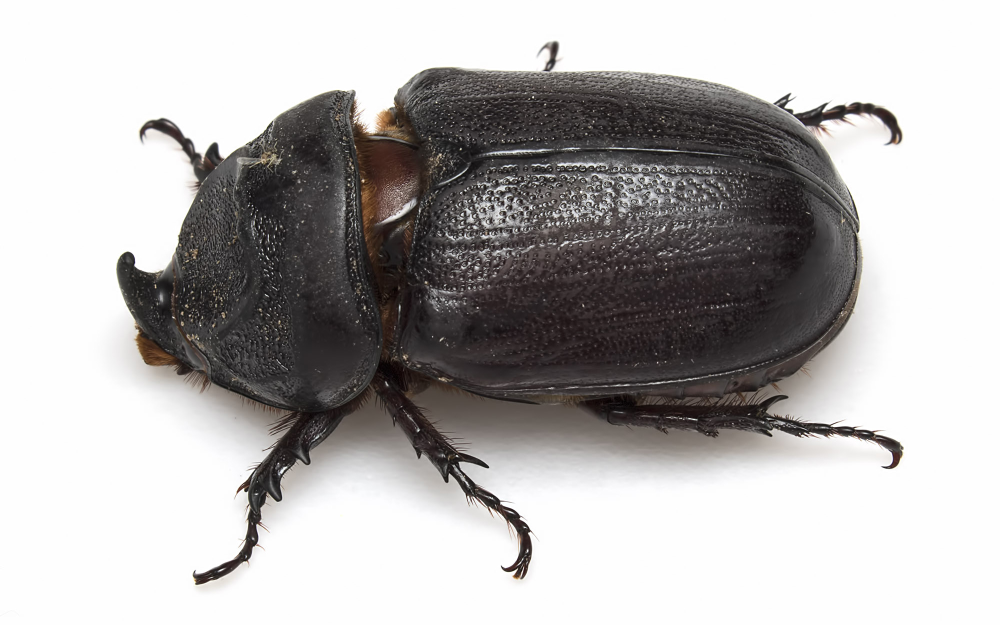
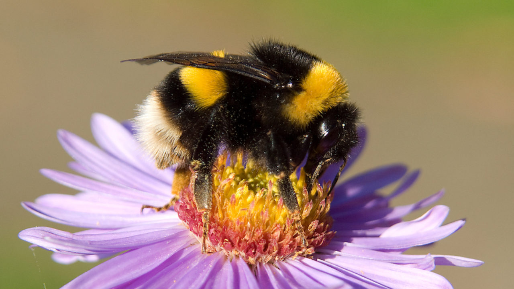

## Bugs {.tabset .tabset-fade .tabset-pills}

### Beetles {.tabset .tabset-fade .tabset-pills}

There are lots of beetles

#### Brown beetles 
Some beetles are brown

#### Blue beetles 
Some beetles are blue

### Bees {.tabset .tabset-fade .tabset-pills}

Bees make honey

#### Big bees  
Bumblebee

#### Nasty bees
Sting you

